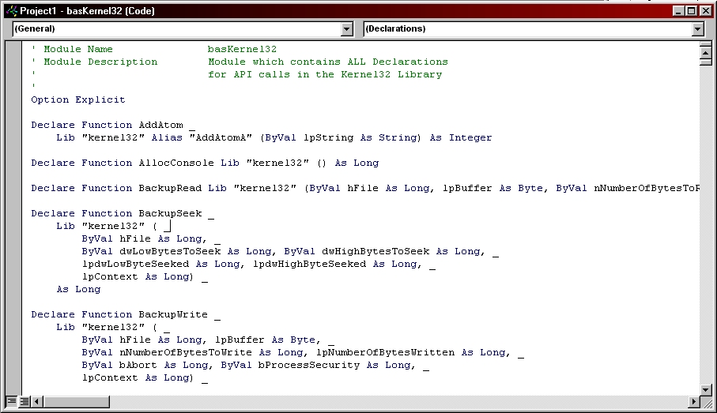



## bas for 13 Windows dll's

### Description

Here are bas for 13 Windows dll's..These are all the calls they make. Here are the bas: Advapi32 Comdlg32 Gdi32 Imm32       Kernel32 Lz32 Mpr32 Netapi32 Shell32 User32 Version Winmm32 Winspool **Note I did not write these so I can't help to much       on what the calls all do.**
 
### More Info
 

             |
---                |---
**Submitted On**   |1997-08-30 10:13:06
**By**             |[mp3guide](https://github.com/Planet-Source-Code/PSCIndex/blob/master/ByAuthor/mp3guide.md)
**Level**          |Advanced
**User Rating**    |4.8 (197 globes from 41 users)
**Compatibility**  |VB 4\.0 \(32\-bit\), VB 5\.0, VB 6\.0
**Category**       |[Windows API Call/ Explanation](https://github.com/Planet-Source-Code/PSCIndex/blob/master/ByCategory/windows-api-call-explanation__1-39.md)
**World**          |[Visual Basic](https://github.com/Planet-Source-Code/PSCIndex/blob/master/ByWorld/visual-basic.md)
**Archive File**   |[CODE\_UPLOAD5575572000\.zip](https://github.com/Planet-Source-Code/mp3guide-bas-for-13-windows-dll-s__1-7927/archive/master.zip)

